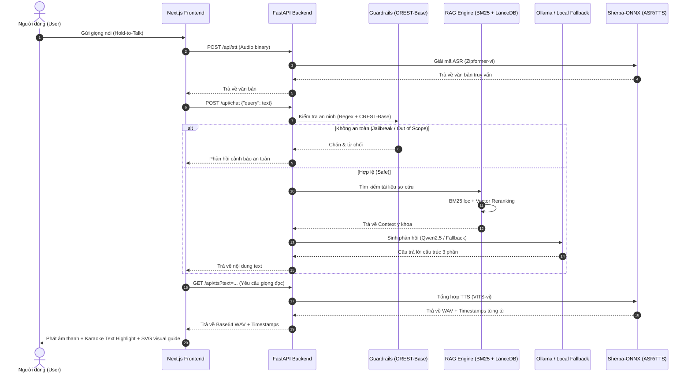

# Báo Cáo Kỹ Thuật: Hướng Dẫn Kiến Trúc Và Bảo Trì Hệ Thống Trợ Lý Y Tế Ngoại Tuyến

🌎 [English Version Here](file:///c:/Users/phand/Project/chatbot%20y%20t%E1%BA%BF/technical_report_EN.md)

Tài liệu này cung cấp cái nhìn chi tiết về kiến trúc phần mềm, cấu trúc luồng dữ liệu, chi tiết triển khai các mô hình AI cục bộ và hướng dẫn quy trình bảo trì, mở rộng hệ thống dành cho các nhà phát triển.

---

## 1. Kiến Trúc Hệ Thống Tổng Thể

Hệ thống được thiết kế theo mô hình **Client-Server cục bộ**. Khi chạy trên di động thực tế, server Python này sẽ được đóng gói hoặc dịch ngược thành các thư viện nhị phân chạy trực tiếp trên thiết bị (hoặc chạy qua một Webview lai hợp).

### Biểu đồ luồng dữ liệu (Data Flow Diagram)



---

## 2. Chi Tiết Triển Khai Các Thành Phần Lõi (Core Codebase)

### 2.1. Cấu Hình Hệ Thống (`config.py`)
Nằm tại [config.py](file:///c:/Users/phand/Project/chatbot%20y%20t%E1%BA%BF/backend/core/config.py), file này quản lý mọi hằng số đường dẫn và ngưỡng kích hoạt (Thresholds).
- **Hàm `get_short_path_name`**: Rất quan trọng trên hệ điều hành Windows, giúp chuyển đổi các đường dẫn dài chứa dấu tiếng Việt hoặc khoảng trắng thành định dạng `8.3 format` (ví dụ: `chatbot~1`). Điều này ngăn chặn lỗi sập (crash) từ nhân C++ của thư viện `sherpa-onnx` hoặc `espeak-ng`.
- **Định dạng dữ liệu**: Thiết lập phân đoạn chunk RAG (`CHUNK_SIZE = 300`, `CHUNK_OVERLAP = 25`).

### 2.2. Màng Lọc Bảo Vệ (`guardrails.py`)
Nằm tại [guardrails.py](file:///c:/Users/phand/Project/chatbot%20y%20t%E1%BA%BF/backend/core/guardrails.py), gồm cơ chế phòng vệ 2 lớp:
- **Lớp 1 (Regex & Từ khóa)**: Phát hiện nhanh bẻ khóa hệ thống (Jailbreak) và tự lọc các câu hỏi hoàn toàn ngoài lề (lập trình, chính trị, mua bán...) để tiết kiệm năng lượng tính toán CPU.
- **Lớp 2 (Học sâu)**: Sử dụng mô hình `repelloai/CREST-Base` (mô hình phân loại đa ngôn ngữ an toàn hệ thống) để phát hiện các cuộc tấn công bẻ khóa tinh vi dùng từ lóng hoặc trộn đa ngôn ngữ Anh-Việt.

### 2.3. Động Cơ RAG (`rag.py`)
Nằm tại [rag.py](file:///c:/Users/phand/Project/chatbot%20y%20t%E1%BA%BF/backend/core/rag.py), thực hiện tìm kiếm lai hợp:
- **BM25 Okapi**: Tiền lọc từ vựng nhanh trên tập tài liệu sơ cứu.
- **LanceDB & sentence-transformers**: Tính toán độ tương đồng không gian vector bằng mô hình `multilingual-MiniLM-L12-v2`.
- **Heuristic bổ trợ**: Chứa ánh xạ từ đồng nghĩa (`SYNONYM_MAP` như *ngộp -> sặc, hóc*) và bộ định tuyến trực tiếp (`_detect_direct_medical_signal`) để tự động bắt nhanh các tình huống chí mạng (ngừng thở, bỏng sâu, đột quỵ) với độ trễ gần như bằng 0.

### 2.4. Kết Nối LLM & Fallback (`llm.py`)
Nằm tại [llm.py](file:///c:/Users/phand/Project/chatbot%20y%20t%E1%BA%BF/backend/core/llm.py), chịu trách nhiệm sinh phản hồi:
- **System Prompt**: Căn chỉnh mô hình Qwen chỉ trả lời dựa vào ngữ cảnh (RAG Context) và bắt buộc định dạng câu trả lời thành 3 phần rõ rệt:
  1. 🚨 HÀNH ĐỘNG KHẨN CẤP CẦN LÀM NGAY
  2. 📋 CÁC BƯỚC SƠ CỨU CHI TIẾT
  3. 📚 NGUỒN TÀI LIỆU THAM KHẢO
- **Màng lọc dự phòng (Fallback Synthesizer)**: Nếu không kết nối được với dịch vụ Ollama cục bộ, hệ thống sẽ tự động tổng hợp thông tin thô từ tài liệu RAG thành đúng cấu trúc 3 phần trên để trả về cho người dùng mà không gây gián đoạn hệ thống.

### 2.5. Xử Lý Giọng Nói Offline (`speech.py`)
Nằm tại [speech.py](file:///c:/Users/phand/Project/chatbot%20y%20t%E1%BA%BF/backend/core/speech.py), là thành phần SOTA về trợ năng:
- **ASR (STT)**: Nạp mô hình Zipformer tiếng Việt thông qua `sherpa-onnx` để nhận dạng khẩu ngữ địa phương hoặc các câu nói ngập ngừng lúc hoảng loạn.
- **TTS**: Sử dụng mô hình VITS tiếng Việt, tạo ra giọng đọc tự nhiên. Hàm sinh âm thanh trả về danh sách `timestamps` chứa thời điểm bắt đầu và thời lượng của từng từ (`word_duration`).
- **Karaoke Highlight**: Khung frontend nhận `timestamps` này để tô sáng màu chữ chuyển động theo tốc độ giọng đọc thời gian thực.

---

## 4. Hướng Dẫn Bảo Trì & Phát Triển Tiếp Cận

### 4.1. Khởi tạo/Cập nhật các mô hình AI học sâu
Khi triển khai trên máy tính mới hoặc muốn nạp lại các mô hình từ Hugging Face, hãy chạy script:
```powershell
python models/download_models.py
```
Script này sẽ tự động tạo thư mục và tải các mô hình:
- Embedding: `sentence-transformers/paraphrase-multilingual-MiniLM-L12-v2`
- Guardrails: `repelloai/CREST-Base`
- STT: `csukuangfj/sherpa-onnx-zipformer-vi-2025-04-20`
- TTS: `csukuangfj/vits-piper-vi_VN-vivos-x_low`
- Gọi API của Ollama để nạp mô hình `qwen2.5:0.5b`.

### 4.2. Sửa lỗi trùng lặp bảng LanceDB (Mục bảo trì sửa lỗi gấp)
Trong [rag.py](file:///c:/Users/phand/Project/chatbot%20y%20t%E1%BA%BF/backend/core/rag.py#L80-L125), quá trình tạo cơ sở dữ liệu LanceDB gặp lỗi `Table already exists` nếu bảng đã được khởi tạo nhưng trống.

> [!WARNING]
> **Hướng dẫn sửa chữa**: 
> Hãy thay thế khối lệnh khởi tạo LanceDB bằng cách kiểm tra sự tồn tại của bảng, nếu bảng đã có và hợp lệ thì mở ra, ngược lại hãy xóa đi tạo mới một cách an toàn.

Đoạn code sửa đổi đề xuất cho [rag.py:L80-125](file:///c:/Users/phand/Project/chatbot%20y%20t%E1%BA%BF/backend/core/rag.py#L80-L125):
```python
    def _init_vector_db(self):
        try:
            os.makedirs(self.vector_store_path, exist_ok=True)
            db = lancedb.connect(self.vector_store_path)
            table_name = "medical_docs"
            table_names = db.list_tables()
            
            # Xóa bảng cũ nếu nó đã tồn tại để tránh lỗi trùng lặp khi chạy lại
            if table_name in table_names:
                db.drop_table(table_name)
                logger.info("Đã dọn dẹp bảng lancedb cũ.")
                
            if not self.embedding_model:
                logger.warning("Embedding model chưa sẵn sàng, bỏ qua tạo vector DB.")
                return

            vector_rows = []
            for doc in self.documents:
                text = self._build_doc_text(doc)
                vector = self.embedding_model.encode([text], convert_to_numpy=True)[0].astype(np.float32).tolist()
                row = {
                    "id": doc["id"],
                    "text": text,
                    "doc_id": doc["id"],
                    "vector": vector,
                }
                vector_rows.append(row)

            self.lancedb_table = db.create_table(table_name, data=vector_rows)
            self.is_vector_db_ready = True
            logger.info("Đã khởi tạo thành công LanceDB.")
        except Exception as e:
            logger.warning(f"Lỗi khởi tạo LanceDB: {e}. Sử dụng RAG fallback.")
```

### 4.3. Bổ sung Tài liệu sơ cứu mới
Để thêm tình huống y tế mới (Ví dụ: sơ cứu say nắng, bỏng lạnh):
1. Mở file dữ liệu [first_aid_data.json](file:///c:/Users/phand/Project/chatbot%20y%20t%E1%BA%BF/backend/data/first_aid_data.json).
2. Thêm một đối tượng JSON mới với cấu trúc:
   ```json
   {
     "id": "heatstroke",
     "title": "Sơ cứu say nắng, sốc nhiệt",
     "caseKey": "heatstroke",
     "keywords": ["say nắng", "sốc nhiệt", "nắng nóng", "xỉu ngoài nắng", "nóng đầu"],
     "emergencyAction": "Đưa nạn nhân vào chỗ mát ngay lập tức. Nới lỏng quần áo và làm mát bằng khăn ướt ấm.",
     "detailedSteps": [
       "Di chuyển nạn nhân đến khu vực bóng râm hoặc phòng điều hòa.",
       "Gọi cấp cứu 115 nếu nạn nhân lơ mơ hoặc ngất xỉu.",
       "Lau người nạn nhân bằng nước mát (không dùng nước đá lạnh để tránh co mạch).",
       "Cho uống nước từng ngụm nhỏ nếu nạn nhân hoàn toàn tỉnh táo."
     ],
     "references": "Cẩm nang chăm sóc sức khỏe mùa nắng nóng - Bộ Y Tế Việt Nam"
   }
   ```
3. Khởi tạo lại vector index bằng cách xóa thư mục `backend/data/lancedb` và khởi động lại server backend.
4. Cập nhật thêm đồ họa SVG hướng dẫn trực quan tương ứng với `caseKey` mới (`heatstroke`) trong frontend tại file [VisualGuide.tsx](file:///c:/Users/phand/Project/chatbot%20y%20t%E1%BA%BF/frontend/components/VisualGuide.tsx) (nếu cần).
5. Mở rộng bộ phân loại heuristic trong file [rag.py:L195-211](file:///c:/Users/phand/Project/chatbot%20y%20t%E1%BA%BF/backend/core/rag.py#L195-L211) bằng cách nhận diện tín hiệu trực tiếp từ từ khóa `"say nang"`, `"soc nhiet"`...

### 4.4. Quy trình Kiểm thử & Đánh giá chất lượng
Mỗi lần sửa đổi thuật toán tìm kiếm RAG hoặc cập nhật tri thức y khoa mới, nhà phát triển bắt buộc phải chạy bộ công cụ đo lường chất lượng:

1. **Chạy E2E Tests (Kiểm thử chức năng API tổng thể)**:
   ```powershell
   $env:PYTHONIOENCODING="utf-8"; .\.venv\Scripts\python.exe backend/tests/test_e2e.py
   ```
2. **Chạy RAG Benchmark (Kiểm định độ chính xác tìm kiếm RAG)**:
   ```powershell
   $env:PYTHONIOENCODING="utf-8"; .\.venv\Scripts\python.exe backend/tests/benchmark_medical_eval.py
   ```
   *Yêu cầu bắt buộc*: Tỷ lệ vượt qua benchmark y tế phải duy trì ở mức **100%** đối với các ca khẩn cấp cốt lõi.
