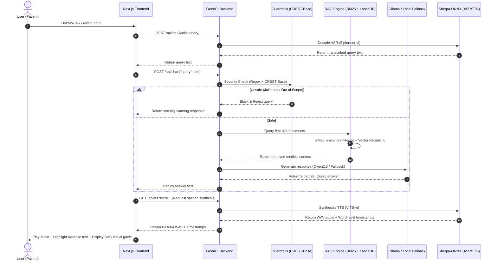

# Technical Report: Architecture & Maintenance Guide for the Offline Medical Assistant System

🇻🇳 [Bản Tiếng Việt Ở Đây / Vietnamese Version Here](file:///c:/Users/phand/Project/chatbot%20y%20t%E1%BA%BF/technical_report.md)

This document provides a detailed overview of the software architecture, data flow pipelines, local AI model integration, and development workflows for maintaining and expanding the Offline Medical Assistant System.

---

## 1. Overall System Architecture

The system is designed around a **local Client-Server model**. In production mobile deployments, this Python server is compiled or wrapped as a binary running alongside a hybrid WebView container on-device.

### Data Flow Diagram



---

## 2. Core Component Implementation Details

### 2.1. System Configuration (`config.py`)
Located at [config.py](file:///c:/Users/phand/Project/chatbot%20y%20t%E1%BA%BF/backend/core/config.py), this module manages path configurations and threshold settings.
- **`get_short_path_name` Utility**: Crucial for Windows deployments. It converts long paths containing Unicode characters or spaces into the short `8.3 format` (e.g., `chatbot~1`). This prevents runtime segmentation faults in C++ cores of `sherpa-onnx` and `espeak-ng`.
- **RAG Chunk Settings**: Configured with `CHUNK_SIZE = 300` and `CHUNK_OVERLAP = 25`.

### 2.2. Safety Guardrails (`guardrails.py`)
Located at [guardrails.py](file:///c:/Users/phand/Project/chatbot%20y%20t%E1%BA%BF/backend/core/guardrails.py), implementing a dual-layer safety mechanism:
- **Layer 1 (Regex & Keyword Filter)**: Quickly detects obvious jailbreak attempts (prompt injections) and filters out completely irrelevant domains (programming, politics, shopping, math) to save processing power.
- **Layer 2 (Deep Learning)**: Deploys the `repelloai/CREST-Base` model (a lightweight multilingual safety classification model) to identify adversarial prompt jailbreaks using slang or code-switching between English and Vietnamese.

### 2.3. Hybrid RAG Engine (`rag.py`)
Located at [rag.py](file:///c:/Users/phand/Project/chatbot%20y%20t%E1%BA%BF/backend/core/rag.py), carrying out a two-stage hybrid retrieval:
- **Stage 1 (BM25 Okapi)**: Quickly screens documents for lexical keywords.
- **Stage 2 (LanceDB + SentenceTransformers)**: Computes semantic vector similarities via the `multilingual-MiniLM-L12-v2` embedding model.
- **Routing Heuristics**: Utilizes a synonym mapping (`SYNONYM_MAP` e.g., "ngộp" -> "ngạt, hóc") and direct classifier routing (`_detect_direct_medical_signal`) to instantly route critical scenarios (CPR, burns, bleeding, choking, stroke, snakebites) with near-zero latency.

### 2.4. LLM Connection & Fallback (`llm.py`)
Located at [llm.py](file:///c:/Users/phand/Project/chatbot%20y%20t%E1%BA%BF/backend/core/llm.py), responsible for response generation:
- **System Prompt Alignment**: Constrains the Ollama Qwen2.5 model to rely strictly on the provided RAG Context and enforces a mandatory 3-part structured format:
  1. 🚨 IMMEDIATE EMERGENCY ACTION
  2. 📋 DETAILED FIRST-AID STEPS
  3. 📚 REFERENCES
- **Fallback Synthesizer**: If the local Ollama service is offline or unreachable, the fallback synthesizer automatically formats the raw RAG context into the exact 3-part structured format, keeping the app functional without service interruption.

### 2.5. Offline Speech Processing (`speech.py`)
Located at [speech.py](file:///c:/Users/phand/Project/chatbot%20y%20t%E1%BA%BF/backend/core/speech.py), providing speech accessibility features:
- **ASR (STT)**: Loads the Vietnamese Zipformer model using `sherpa-onnx` to recognize conversational dialects and hesitant speech under stress.
- **TTS**: Employs the VITS model to synthesize natural-sounding speech. The generation function outputs a list of word-level `timestamps` containing the start time and duration for each word.
- **Karaoke Highlight**: The Next.js frontend uses these timestamps to highlight words in real-time as the audio plays.

---

## 3. Maintenance & Development Guidelines

### 3.1. Downloading & Initializing Deep Learning Models
When setting up on a new machine or downloading models from Hugging Face, run the setup script:
```powershell
python models/download_models.py
```
This script initializes directories and downloads the following models:
- Embedding: `sentence-transformers/paraphrase-multilingual-MiniLM-L12-v2`
- Guardrails: `repelloai/CREST-Base`
- STT: `csukuangfj/sherpa-onnx-zipformer-vi-2025-04-20`
- TTS: `csukuangfj/vits-piper-vi_VN-vivos-x_low`
- Connects to Ollama to pull `qwen2.5:0.5b`.

### 3.2. Troubleshooting LanceDB Table Initialization (Maintenance Critical)
In [rag.py](file:///c:/Users/phand/Project/chatbot%20y%20t%E1%BA%BF/backend/core/rag.py#L80-L125), LanceDB table creation might crash with a `Table already exists` error if an empty table structure exists from previous runs.

> [!WARNING]
> **Resolution Guide**:
> Replace the LanceDB initialization code block to drop the old table and recreate it safely if it exists, ensuring index files are re-indexed cleanly.

Reference implementation of the modified `_init_vector_db` in [rag.py:L80-125](file:///c:/Users/phand/Project/chatbot%20y%20t%E1%BA%BF/backend/core/rag.py#L80-L125):
```python
    def _init_vector_db(self):
        try:
            os.makedirs(self.vector_store_path, exist_ok=True)
            db = lancedb.connect(self.vector_store_path)
            table_name = "medical_docs"
            table_names = db.list_tables()
            
            # Drop old table if it exists to avoid duplication errors on re-index
            if table_name in table_names:
                db.drop_table(table_name)
                logger.info("Cleared old lancedb table.")
                
            if not self.embedding_model:
                logger.warning("Embedding model not ready, skipping vector DB creation.")
                return

            vector_rows = []
            for doc in self.documents:
                text = self._build_doc_text(doc)
                vector = self.embedding_model.encode([text], convert_to_numpy=True)[0].astype(np.float32).tolist()
                row = {
                    "id": doc["id"],
                    "text": text,
                    "doc_id": doc["id"],
                    "vector": vector,
                }
                vector_rows.append(row)

            self.lancedb_table = db.create_table(table_name, data=vector_rows)
            self.is_vector_db_ready = True
            logger.info("Successfully initialized LanceDB.")
        except Exception as e:
            logger.warning(f"Error initializing LanceDB: {e}. Falling back to keyword search.")
```

### 3.3. Appending New First-Aid Guides
To add a new first-aid scenario (e.g., heatstroke, hypothermia):
1. Open the JSON database at [first_aid_data.json](file:///c:/Users/phand/Project/chatbot%20y%20t%E1%BA%BF/backend/data/first_aid_data.json).
2. Append a new JSON object using the following structure:
   ```json
   {
     "id": "heatstroke",
     "title": "First Aid for Heatstroke",
     "caseKey": "heatstroke",
     "keywords": ["heatstroke", "sunstroke", "hot weather", "fainting in sun", "overheating"],
     "emergencyAction": "Move the person to a cool area immediately. Loosen tight clothing and cool them with warm wet towels.",
     "detailedSteps": [
       "Move the victim to shade or an air-conditioned room.",
       "Call emergency services 115 if the victim is confused or unconscious.",
       "Wipe their body with cool water (do not use ice water to prevent vasoconstriction).",
       "Give sips of water if the victim is fully awake and conscious."
     ],
     "references": "Heatstroke Prevention and Care Manual - Vietnam Ministry of Health"
   }
   ```
3. Re-index the vector index by deleting the folder `backend/data/lancedb` and restarting the FastAPI backend server.
4. Add corresponding SVG visual instructions for the new `caseKey` (`heatstroke`) in the frontend at [VisualGuide.tsx](file:///c:/Users/phand/Project/chatbot%20y%20t%E1%BA%BF/frontend/components/VisualGuide.tsx) (if needed).
5. Update the heuristic classifier rules in [rag.py:L195-211](file:///c:/Users/phand/Project/chatbot%20y%20t%E1%BA%BF/backend/core/rag.py#L195-L211) to intercept terms like `"say nang"`, `"soc nhiet"`, etc.

### 3.4. Testing & Verification Procedures
After modifying RAG search scripts or adding medical content, run the quality assurance scripts:

1. **E2E Functional Tests**:
   ```powershell
   $env:PYTHONIOENCODING="utf-8"; .\.venv\Scripts\python.exe backend/tests/test_e2e.py
   ```
2. **RAG Accuracy Benchmark**:
   ```powershell
   $env:PYTHONIOENCODING="utf-8"; .\.venv\Scripts\python.exe backend/tests/benchmark_medical_eval.py
   ```
   *Requirement*: The RAG retrieval accuracy benchmark score must remain at **100%** for all core first-aid cases.
